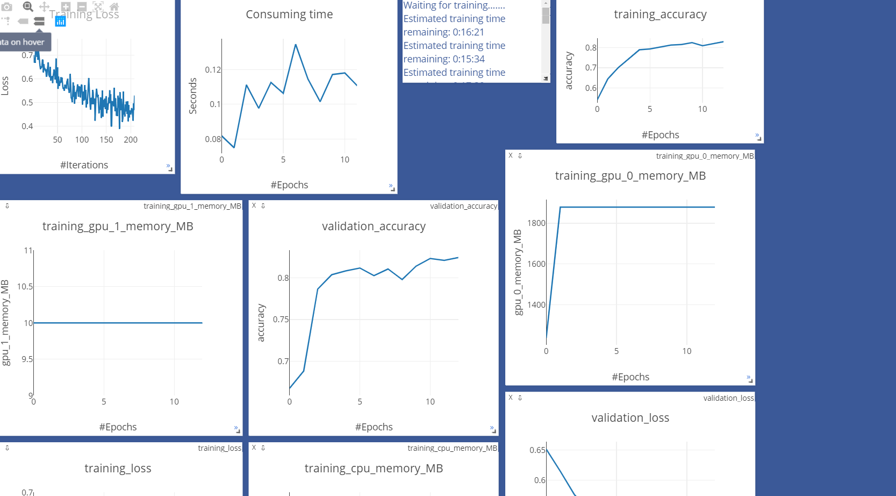

# 我想使用visdom功能实时监测

[AllenNLP](https://github.com/allenai/allennlp)

因此魔改一下allennlp，添加visdom的功能。

---
+ 仅仅更改的是train文件。  
  + 有趣的是，tensorboard可能会报一个错，是多传入了epoch=epoch+=1,  
  不清楚是不是因为fork的代码是旧版的代码(?) 


使用方法是传入一个定义好的visdom的对象，  
如`visdom_object=vis.Visdom(port=9010, env="BERT_ALLEN")`：

```
trainer = Trainer(
    model=model,
    optimizer=optimizer,
    iterator=iterator,
    train_dataset=train_ds,
    cuda_device=0 if USE_GPU else -1,
    num_epochs=config.epochs,
    validation_dataset=val_ds,
    patience=config.patience,
serialization_dir='./bert_saved',
num_serialized_models_to_keep=5,
    visdom_object=visdom_object
)

```
# 效果如图所示，实时监察运行情况。


注意，因为我是用epoch作为横轴，  
allennlp默认是断点继续训练，因此会有图像从非零开始，这说明你之前训练的模型没有删除。  
如果一定要从坐标原点开始，建议直接删除已保存的文件。
